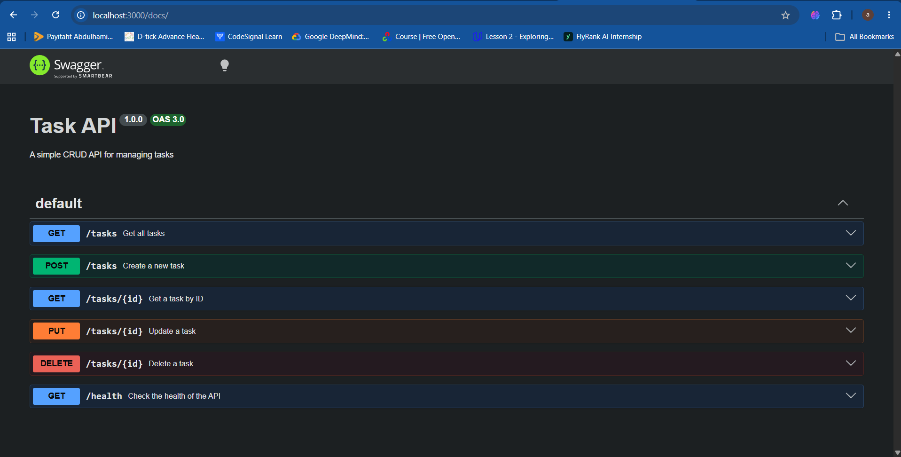

# Task API — CRUD API

A simple REST API built using **Node.js** and **Express.js** that manages a to-do task list.

This project demonstrates the four main CRUD operations:

* Create
* Read
* Update
* Delete

The API uses **SQLite** for persistent data storage. Tasks are stored in a local `tasks.db` database file, so data remains available even after the server is restarted.

---

# Features

* RESTful API endpoints
* Create new tasks
* Retrieve all tasks
* Retrieve a single task by ID
* Update existing tasks
* Delete tasks
* SQLite database persistence
* Automatic database and table creation
* Three seed tasks on the first run
* Request validation
* Proper HTTP status codes
* Parameterized SQL queries
* Interactive Swagger API documentation

---

# Technologies Used

* Node.js
* Express.js
* SQLite
* better-sqlite3
* Swagger UI Express
* Swagger JSDoc

---

# Database

The application uses a SQLite database named:

```text
tasks.db
```

The database and `tasks` table are created automatically when the server starts.

The `tasks` table contains the following fields:

| Column       | Type     | Description                    |
| ------------ | -------- | ------------------------------ |
| `id`         | INTEGER  | Primary key                    |
| `title`      | TEXT     | Task title                     |
| `done`       | INTEGER  | Task completion status         |
| `created_at` | DATETIME | Time the task was created      |
| `updated_at` | DATETIME | Time the task was last updated |

On the first run, if the table is empty, the application creates three example tasks.

The seed tasks are only inserted when the table contains no tasks. Existing data is not replaced when the server restarts.

---

# Installation

## 1. Clone the repository

```bash
git clone https://github.com/ashpokkk/CRUD_API.git
```

## 2. Navigate into the project

```bash
cd CRUD_API
```

## 3. Install dependencies

```bash
npm install
```

---

# Running the Server

Start the server using:

```bash
node server.js
```

The API will be available at:

```text
http://localhost:3000
```

The SQLite database file `tasks.db` will be created automatically if it does not already exist.

---

# API Endpoints

| Method | Endpoint     | Description             |
| ------ | ------------ | ----------------------- |
| GET    | `/tasks`     | Retrieve all tasks      |
| GET    | `/tasks/:id` | Retrieve a single task  |
| POST   | `/tasks`     | Create a new task       |
| PUT    | `/tasks/:id` | Update an existing task |
| DELETE | `/tasks/:id` | Delete a task           |
| GET    | `/health`    | Check API health        |

Successful requests use the appropriate HTTP status codes, including:

* `200` — Successful read/update
* `201` — Task successfully created
* `204` — Task successfully deleted
* `400` — Invalid request
* `404` — Task not found

---

# SQLite Persistence

Unlike the previous in-memory version of the API, this version stores tasks in SQLite.

CRUD operations use SQL statements to interact with the database:

* `SELECT` is used to retrieve tasks.
* `INSERT` is used to create tasks.
* `UPDATE` is used to modify tasks.
* `DELETE` is used to remove tasks.

SQL queries use **parameterized placeholders** instead of directly inserting user input into SQL statements.

Because the data is stored in `tasks.db`, changes remain after the server is stopped and restarted.

---

# Swagger Documentation

Interactive API documentation is available through Swagger UI at:

```text
http://localhost:3000/docs
```

Swagger provides an interactive interface for viewing and testing all available API endpoints.



---

# Database Browser Screenshot

The SQLite database can also be inspected manually using **DB Browser for SQLite**.

The screenshot below shows the `tasks` table and its stored data:


---

# Project Structure

```text
CRUD_API/
│
├── server.js
├── db.js
├── tasks.db
├── package.json
├── package-lock.json
├── README.md
├── image.png
└── database-screenshot.png
```

---

# Repository

GitHub repository:

https://github.com/ashpokkk/CRUD_API.git
